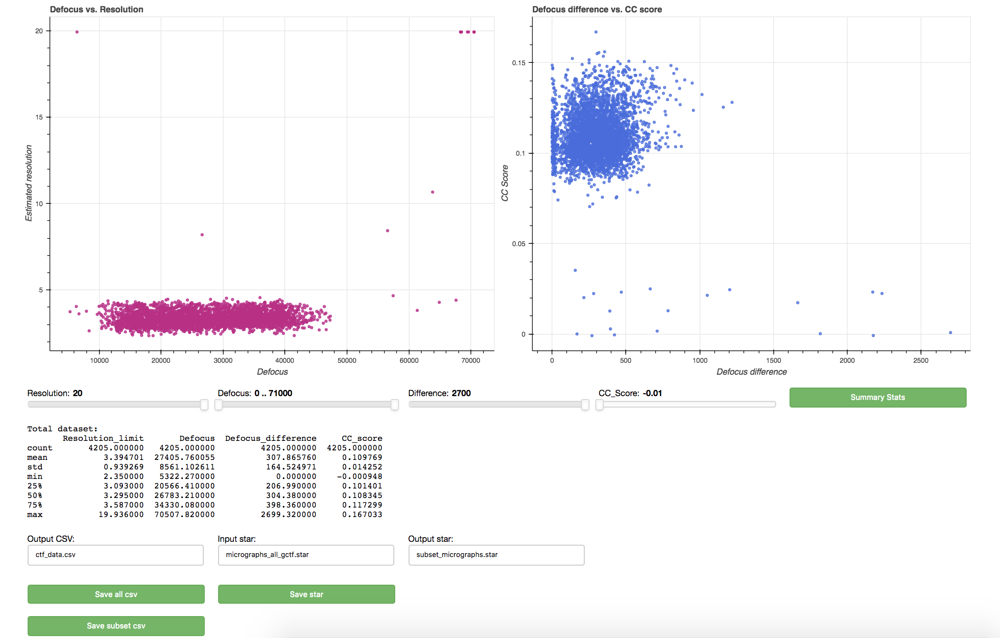
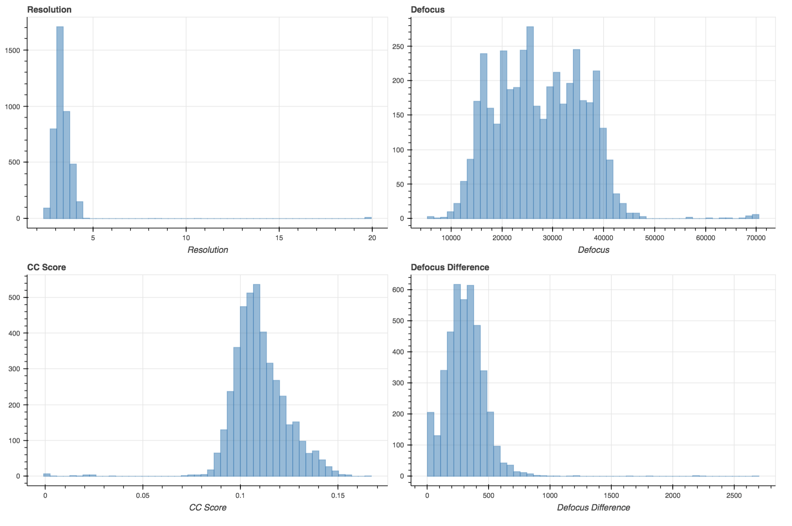

# CTF Analysis
This app will display interactive scatterplots that allow you to check the quality of data following collection and output a star file that is subsetted to only include the data you want.

### Dependencies
Requires installation of numpy, pandas and bokeh. This can be done through pip or conda.

### Data Plotted
Four fields are plotted: 
* Estimated resolution that thon rings extend to
* Defocus (average of DefocusU and DefocusV)
* Defocus difference (absolute difference between DefocuU and DefocusV)
* Cross correlation score

### Running
The only input needed is the path to your CTF log files (e.g. Micrographs/*ctffind3.log). At some point you will be able to just give the star file output from GCTF or CTFFIND4 (if run through relion).

The command is `bokeh serve --show /path/to/.../ctf_analysis/ --args input` (e.g. `bokeh serve --show /path/to/.../ctf_analysis/ --args Micrographs/*.log`). I would make an alias in your .bashrc (e.g.`alias ctf_analysis='bokeh serve --show /path/to/.../ctf_analysis/ --args'`) and then you can just run `ctf_analysis Micrographs/*.log`.

### Result
This command should automatically open your browser to `localhost:5006` (or else open manually). The main page should look similar to below:

The plots are responsive and the sliders allow you to filter your data. The plots are linked so if you filter a point away on the left plot it will be removed from the right.

A summary of the complete dataset is given and you can generate one for your current subset by clicking the `Summary Stats` button.

Output a csv with the extracted values (e.g. if you want to plot in another program) with either the `Save all csv` or `Save subset csv`. This will be written with the name given in the text box above.

Output a star file to read into relion containing just your current subset with the `Save star` button. This requires an input star to be provided in the text box above (defaults to micrographs_all_gctf.star) that contains all the information you would want in the output file (e.g. what was output from GCTF or CTFFIND (if it was run through relion)).

There is a second tab (Summary) that just contains histograms to show your overall data distribution. These don't do anything fun.

